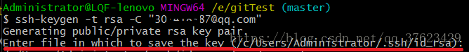
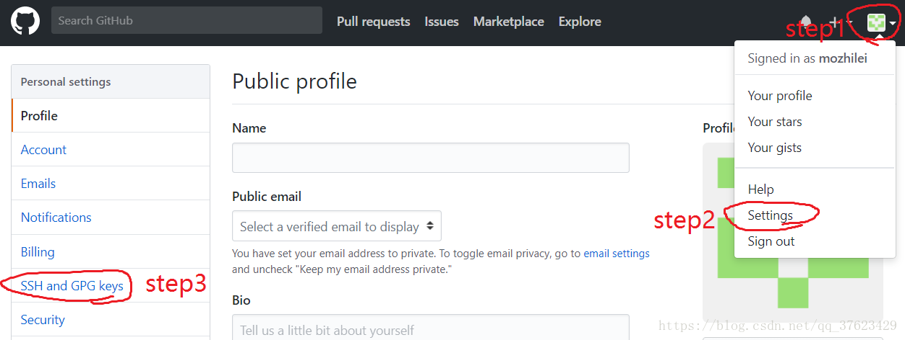
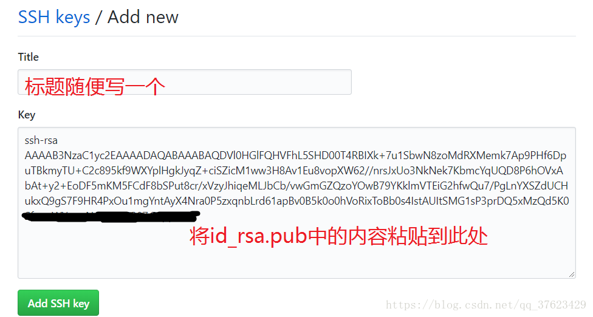
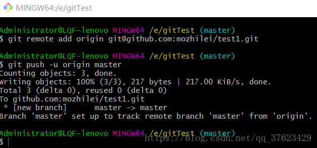
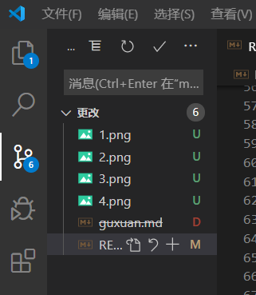

#  GitHub学习总结

## GitHub的简单操作

了解到GitHub十分牛逼，考虑用其做笔记和上传代码，其实再开始自己配置过了一次，但是后来改变了git安装文件夹名称，导致git bash无法使用。

1. 首先登录GitHub网页并创建一个自己的账号
    emmmm这个不用说了吧，应该是比较好创建的

2. GitHub下创建仓库
    个人理解GitHub下创建的仓库就类似于创建一个文件夹，然后便可以在仓库中添加文件等等，其过程在网上都可以搜到。

3. GitHub创建个人博客
    关于这个，个人主要学习了如何创建一个博客，如何使用，如何进行HTTP等我还没有了解，这个和本次实现本地文件和GitHub文件同步关系不大，所以并未过多了解如何创建博客。
##  下载Git

这个在官网下载即可，下载过程比较简单。
配置环境变量：win + R ——> 环境变量——>path——>添加git的路径

##  初始化Git

网上基本上都能搜到，运行git-bash.exe
1. 初始化时输入：

        git config --global user.name "Your Name"
        git config --global user.email "email@example.com"
    上面分别时你的GitHub账号名和邮箱地址。

2. 设置ssh（仅首次使用需要配置）
    创建SSH Key：在gitbash中输入

        ssh-keygen -t rsa -C "youremail@example.com"

    
  
    在提示的路径中的.ssh文件夹中有2个文件，分别为id_rsa(私钥)和id_rsa.pub（公钥）。

    用记事本打开id_rsa.pub,复制其中的内容，打开并登陆github。    打开GitHub，在个人设置（Settings）中找到SSH设置，点击添加sshkey（new ssh key）
    将复制内容粘贴到添加的SSH的key中，其标题可以随便，如下图。
    
    

##  文件同步
利用上面说的建立一个GitHub仓库（这个网上可以搜索GitHub如何建立仓库）

返回Windows桌面，新建一个文件夹，右键该文件夹，用git bash打开。

输入：git init 
原文件夹出现一个.git文件夹，这类似于说明该文件夹可使用git操作。

输入：touch aaa.md
相当于建议一个markdown文件，该文件就是我们本次实验同步的文件（其内容是空的）

输入：git add aaa.md
将该文件暂存进入更改

输入：git commit -m "描述内容"
对本次操作的描述内容

输入：git remote add origin git@github.com:mozhilei/test1.git
建立文件和GitHub仓库的连接，其中git@github.com后面的内容(mozhilei/test1)改为你自己的用户名和仓库名 

输入： git push -u origin master
将修改同步到GitHub中，再打开GitHub（最好刷新一下）便可以看到aaa.md已经上传了。

##  利用vscode进行文件同步
在bash中弄完之后感觉不是很方便，vscode是一个很好的编辑器，考虑在vs code进行同步将会变得非常简单，而且方便写文档和代码。

1. 安装插件：Git Extension Pack
    该插件可以进行同步，只需要下载完启用即可，也可以另外下载一个Git History，顾名思义就是能够查看你对GitHub仓库进行的更改。

2. 在该文件夹下新建文件或者修改文件都很方便。
   修改或者创建之后可以发现源代码管理（最左边第三个按钮）会显示有多少个更改。更改完成之后，在源代码管理下点击暂存所有更改，完成之后点击三个点（...）的更多操作，最后推送即可完成。

注意：推送时他会弹出让你写更改描述的东西，这个随便写一下就可以，这样是为了让你自己知道自己为何更改。

##  遇到的坑
原来我弄过这个东西，但没有太认真配置，这次发现bash直接不能使用了，于是又学习了一遍。

开始由于我改变了git文件夹的名称，所以那个环境变量和注册表里的东西全都不能用，上网查询之后我又改回来了。所以之后装应用的文件夹不要轻易改变名称，不然可能环境变量啥的都不能用了。

vs code配置时开始那个源代码管理总是没反应，后来发现是插件没有启用，将其启用就好了，将Git Extension Pack插件启用

通过本次配置发现vs code功能确实强大，但是可能自己配置起来会有点复杂，不过不要怕，慢慢来的话可能会发现越来越简单吧，慢慢理解其原理和方法就好了。由于Vs code比较方便和GitHub同步，所以今后自己可能会考虑更多的使用vs code作为编辑器。

##  常用命令
    git init //把一个文件夹弄成git
    touch aaa.md  //新建一个aaa.md文件
    git add aaa.md  //将该文件暂存进入更改
    git commit -m "描述内容"   //本次修改的描述内容
    git remote add origin git@github.com:mozhilei/test1.git
    建立文件和GitHub仓库的连接，其中git@github.com后面的内容(mozhilei/test1)改为你自己的用户名和仓库名 
    git push -u origin master   //同步推送

    git remote remove origin    //移除远端仓库