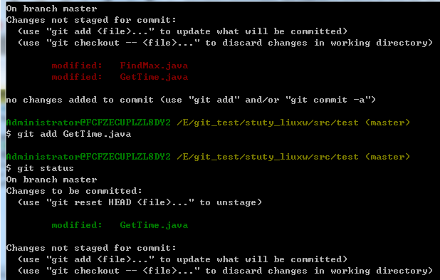

#   git常见命令
##  简介
git：分布式的版本管理系统，一般的开发模式：

如果是开发人员，忽略此步骤：

项目开始阶段，初始化项目（init），提交本地的代码到仓库，将本地仓库的代码推送到远端库（push）；

项目开发人员从远端库克隆代码到本机（clone），此时本地仅有一个master分支；新建dev分支并切换、在Dev分支中进行开发工作，其实就是修改并提交代码（add+commit）；当开发的dev分支的代码没问题时，将dev分支合并（merge）到master；将master推送到远端分支，至此，其他的项目开发人员就可以查看到你提交的代码了！

dev分支也可以是修复某个bug或者为了开发某个issue建立的，当bug已经修复或issue开发完成时，把dev合并到master之后，就可以把它删除了

 

 

##  git基本命令

1. 初始化：创建一个git仓库，创建之后就会在当前目录生成一个.git的文件

        git init

 

2. 添加文件：把文件添加到缓冲区

        git add filename

    添加所有文件到缓冲区（从目前掌握的水平看，和后面加“.”的区别在于，加all可以添加被手动删除的文件，而加“.”不行）：

        git add .

        git add --all

3. 删除文件

        git rm filename

 

4. 提交：提交缓冲区的所有修改到仓库(注意：如果修改了文件但是没有add到缓冲区，也是不会被提交的)

        git commit -m "提交的说明"

    commit可以一次提交缓冲区的所有文件

5. 查看git库的状态，未提交的文件，分为两种，add过已经在缓冲区的，未add过的

        git status 

从图中可以看出，绿色的就是已经add过的

 

 

6. 比较：如果文件修改了，还没有提交，就可以比较文件修改前后的差异

        git diff filename 

 

7. 查看日志

        git log

 

8. 版本回退：可以将当前仓库回退到历史的某个版本

        git reset 

    第一种用法：回退到上一个版本（HEAD代表当前版本，有一个^代表上一个版本，以此类推）

        git reset --hard HEAD^

    第二种用法：回退到指定版本(其中d7b5是想回退的指定版本号的前几位)

        git reset --hard d7b5

 9. 查看命令历史：查看仓库的操作历史

        git reflog

## 分支管理

10. git分支管理

        git branch
    
    查看分支的情况，前面带*号的就是当前分支 

 

11. 创建分支

        git branch 分支名

 

12. 切换当前分支到指定分支

        git checkout 分支名

 

13. 创建分支并切换到创建的分支

        git checkout  -b 分支名

 

14. 合并某分支的内容到当前分支

        git merge 分支名

 

15. 删除分支
        
        git branch -d 分支名

    如果两个分支同时进行了同一个文件的修改和提交，在merge时就会产生冲突，首先要手动打开文件解决冲突，再提交，就相当于进行了merge

16. 查看分支合并图

        git log --graph

 

17. 新建标签，默认为最新版本，后面加上版本号参数则可指定版本增加标签

        git tag 标签名 版本号

 

18. 查看所有标签：

        git tag

 

19. 查看标签的详细信息

        git show 标签名

 

20. 将tag提交到远端仓库

        推送所有tag:
        git push origin --tags

        推送某个tag：
        git push origin v1.0 

##  远端库相关

21. git远端库相关

        git remote add origin git://127.0.0.1/abc.git 
        
    这样就增加了远程仓库abc。

        git remote remove origin
    移除远端仓库

 
22. 推送

        git push -u origin master

    将本地仓库内容推送到远端仓库(-u 表示第一次推送master分支的所有内容，后面再推送就不需要-u了)，跟commit的区别在于一个是提交到本地仓库，一个是提交到远程仓库

 

23. 从远端库更新内容到本地（相当于svn的update），

        git pull

    tips:如果push的时候，本地和文件和远端文件有冲突，就要先pull、然后手动解决冲突，才能继续push

 

